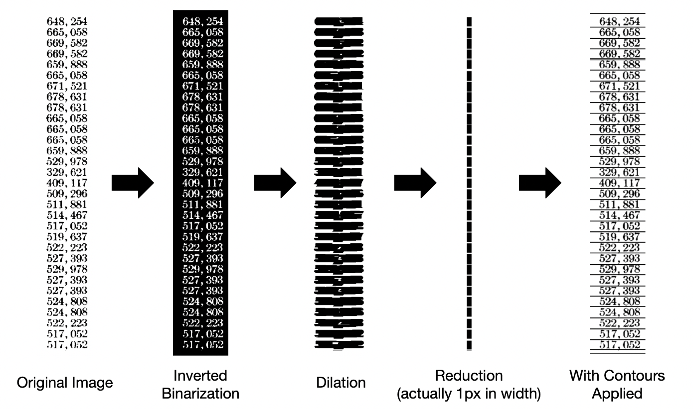

# OCR coding task for research position

This repository constitutes a coding problem aimed at assessing your ability to work with GitHub, Python, and basic OCR tools. You are welcome (and even encouraged to) use AI such as ChatGPT to help you with this, and please do not hesitate to reach out to annaboser@ucsb.edu if you have any questions about the problem or need a hint. We expect this will take you approximately 2 hours to complete. Email your solution to annaboser@ucsb.edu and ahilton@ucsb.edu by midnight on April XX, 2024.

## Instructions: 

This problem requires you to digitize the numbers in the `data` folder of this directory. These numbers were pulled from a historical hydrological document like the one we would be working to digitize. To do so: 

1. Fork this repository to create your own to work out of. Make it a public repository. Clone it to your local computer. 
1. Create a `code/` folder. Write Python code in this folder which generates an `output.txt` file (housed in the main repository). This file will list all the numbers written on the images in the `data/` folder in the order of their image name (i.e. `image_1.png`, then `image_2.png`, etc.) , with a new number on each new line. 
1. Run your python code to generate the `output.txt` file. It's 100% fine if all the numbers are not correct. 
1. Document your work (see below for detailed instructions). Make sure everything is committed and pushed. 
1. Email a link you your completed forked repository to annaboser@ucsb.edu and ahilton@ucsb.edu by midnight on April XX, 2024. Please ensure it is public so we can review it. 

### By the end of the problem, your repository should include: 
1. A `requirements.txt` or similar file with all the Python packages required to run your code specified and a filled out section to the readme (see below) with setup instructions such that I can easily recreate your environment and run your code
1. A `code` folder containing all the Python code necessary to generate the output file and a filled out section of the readme explaining these contents and how to run the code. Please additionally ensure that the code is properly commented and easily readable. 
1. The `output.txt` file containing the numbers printed on the documents in the data folder, in order and with a new line for each new entry. 


# My Work

## Introduction
First of all, thank you again for the oppportunity to complete this project, I had a lot of fun working on it! I ended up going a bit beyond the demands of the task as that seemed to work pretty well for me as far as getting the interview in the first place. 

First, I completed the assigned OCR task by using the Tesseract OCR engine, which is the most commonly used open-source OCR engine that uses a pre-trained Convolutional Neural Network to identify text from images. I did some image preprocessing with openCV, an open-source computer vision library, to try to improve the accuracy of the OCR. That was fun but I felt that in order to improve recognition performance I was going to need additional data to fine-tune the model with built-in tools from Tesseract (I did not end up fine-tuning the model). To gather more images like the ones you provided, I decided to dive into how I can use openCV to cut the images automatically. I also thought this might be useful if I end up being selected for the position. 

I provide an overview of what the code does below, for more detailed line-by-line descriptions I left comments within the code. 

## Data Separation
While I could have just gone through and manually cut out the numbers from the larger example you provided to build additional data points, that seemed like it was going to take forever. So instead I embarked on the long journey of figuring out how to use openCV to detect the edges of numbers and cut them out automatically. 

### Pre-processing for Data Separation
In order to properly detect the edges of the numbers I need to do a couple of pre-processing steps in openCV. First I put the images through binarization because it seemed like a standard first step. Then I applied a dilation affect to essentially expand the black sections of the image (the numbers) into rectangles with more obvious edges. Then we reduce the image to a single line of pixels, and grab the contours of the white spaces. You can see this process play out below:



### Cutting for Data Separation
Once I had the y-values of the white spaces it was pretty easy to cut the image up. I did later realize that becuase every number is the same height it should have been relatively easy to just cut things up at set intervals, but this tool is better because it is adaptable to data with varying distances between numbers and multi-line numbers. 

You can see the outputted images in the /more_data/cut_images directory. Though it should be noted that I did not have time to figure out how to use them to fine-tune the Tesseract model, but I know it is possible.  

## OCR Task
The OCR task ended up being a little simpler than the data separation I chose to attempt. I used some simple pre-processing techniques to just binarize the image into black and white and then used the resize method to attempt to spread the numbers horizontally and blur some of the edges. I found that helped a lot in numbers that had two digits close together. 

For the OCR itself I just used the newest Tesseract model with a character blacklist to exlclude the alphabet and common non-number symbols. 

# Setup instructions

1. Start by setting up and activating a new virtual environment to isolate your project dependencies.
```
python3 -m venv venv
source venv/bin/activate
```

2. Install Tesseract OCR engine ([Installation Documentation](https://tesseract-ocr.github.io/tessdoc/Installation.html)) and Python dependencies using the following commands in your terminal

```
brew install tesseract
pip install pytesseract
pip install opencv-python
pip install numpy
```


# Instructions to reproduce the output

1. Clone this repository to your local machine and navigate to the project directory.
2. Activate your virtual environment.
3. Follow Setup Instructions above. 
4. Run the main.py script located in the code folder using the following command:
```bash
python3 code/main.py
```
5. (Optional) If you want to do the data generation you use this script. 
```bash
python3 more_data/cut_image.py
```

The first script will process the images in the data folder, perform OCR using Tesseract, and generate an output.txt file containing the numbers extracted from the images.

The second script is for cutting images to generate more training data. You will find the output in the /more_data/cut_images directory.

## Conclusion
I had a lot of fun working on this and would love the opportunity to continue doing so for the forseeable future. 